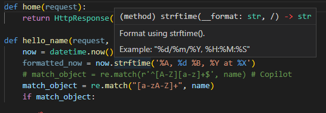
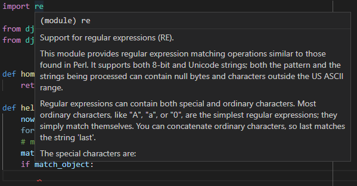
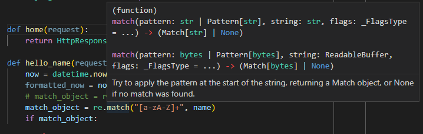

# Django Tutorial in Visual Studio Code

* Repository for notes and code in 'Django Tutorial in Visual Studio Code'.

## Resources

* [The Tutorial](https://code.visualstudio.com/docs/python/tutorial-django)
* [My repository](https://github.com/brucestull/django-vscode)
* [Sample code](https://github.com/microsoft/python-sample-vscode-django-tutorial)
* [Django Admin Documentation Generator](https://docs.djangoproject.com/en/4.1/ref/contrib/admin/admindocs/)

## New Concepts and Review

### New Concepts

* "Ctrl + Shift + `":
  * Opens the terminal in VS Code.
  * Prompts for choice of python interpreter and opens the terminal, in the available pipenv, in VS Code.
* `a_string.strf()`
  * String format:

    
* `re`
  * Regular expressions:

    
* `re.match()`
  * Matches a regular expression to a string:

    
* [Create a code snippet](https://code.visualstudio.com/docs/python/tutorial-django#_create-a-code-snippet)

### Review

* `python -m pip install --upgrade pip`
  * Upgrades pip.

### Links for Big Concepts

* [Prerequisites](https://code.visualstudio.com/docs/python/tutorial-django#_prerequisites)
* [Create a project environment for the Django tutorial](https://code.visualstudio.com/docs/python/tutorial-django#_create-a-project-environment-for-the-django-tutorial)
* [Create and run a minimal Django app](https://code.visualstudio.com/docs/python/tutorial-django#_create-and-run-a-minimal-django-app)
* [Create a debugger launch profile](https://code.visualstudio.com/docs/python/tutorial-django#_create-a-debugger-launch-profile)
* [Explore the debugger](https://code.visualstudio.com/docs/python/tutorial-django#_explore-the-debugger)
* [Go to Definition and Peek Definition commands](https://code.visualstudio.com/docs/python/tutorial-django#_go-to-definition-and-peek-definition-commands)
* [Use a template to render a page](https://code.visualstudio.com/docs/python/tutorial-django#_use-a-template-to-render-a-page)
* [Serve static files](https://code.visualstudio.com/docs/python/tutorial-django#_serve-static-files)
* [Create multiple templates that extend a base template](https://code.visualstudio.com/docs/python/tutorial-django#_create-multiple-templates-that-extend-a-base-template)
* [Work with data, data models, and migrations](https://code.visualstudio.com/docs/python/tutorial-django#_work-with-data-data-models-and-migrations)
* [Use the debugger with page templates](https://code.visualstudio.com/docs/python/tutorial-django#_use-the-debugger-with-page-templates)
* [Optional activities](https://code.visualstudio.com/docs/python/tutorial-django#_optional-activities)
* [Next steps](https://code.visualstudio.com/docs/python/tutorial-django#_next-steps)

## Related Code Snippets

## Related Django Admin Images

## TODO

## Notes

## Directory Structure
